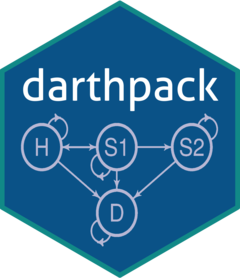

Running To Do List
=============
**Towards two severity distribution**
- [ ] Population cohort input values (Statline)
- [ ] Incidence of Glaucoma
- [ ] AI Screening sensitivity / specificity numbers
- [ ] No show percentage
- [ ] Clinician sensitivity / specificity 

Preliminaries
=============

-   Install [RStudio](https://www.rstudio.com/products/rstudio/download/)
-   Install `devtools` to install `darthpack` as a package and modify it to generate your own package

``` r
# Install release version from CRAN
install.packages("devtools")

# Or install development version from GitHub
# devtools::install_github("r-lib/devtools")
```

-   Install `pkgdown` to publish `darthpack` or your own `darthpack`-based repository or package as a website (optional)

``` r
# Install release version from CRAN
install.packages("pkgdown")

# Or install development version from GitHub
# devtools::install_github("r-lib/pkgdown")
```

Template obtained from Darthpack 
=======================================================================
[](https://zenodo.org/badge/latestdoi/197059951)

<!--  -->
[`darthpack`](https://github.com/DARTH-git/darthpack) is an R package that showcases the [Decision Analysis in R for Technologies in Health (DARTH)](https://darthworkgroup.com) coding framework to construct model-based cost-effectiveness analysis in R. The main website of `darthpack` can be [found here](https://darth-git.github.io/darthpack/).

[`darthpack`](https://github.com/DARTH-git/darthpack) is part of the following manuscript:

-   Alarid-Escudero F, Krijkamp E, Pechlivanoglou P, Jalal H, Kao SY, Yang A, Enns EA. ["A need for change! A coding framework for improving transparency in decision modeling"](https://link.springer.com/article/10.1007%2Fs40273-019-00837-x). PharmacoEconomics 2019;37(11):1329–1339. <http://dx.doi.org/10.1007/s40273-019-00837-x>
